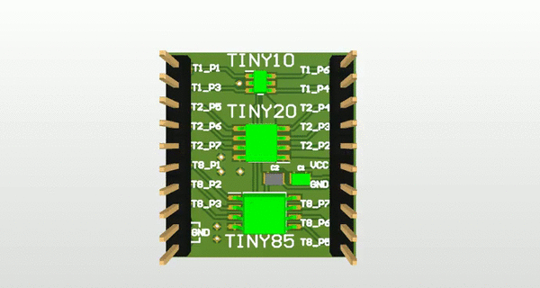

# ATtiny 10/20/85 Brakeout Board

## Description
###### An ATtiny brakeout board for ATtiny 10/202/85. You can use it for any device you need it. It's desinged in Altium Designer 20 and you can open and edit the project under the file Sourcer/ATTINY.PrjPcb

## How to print the board
###### Firstly clone the project by typing
```
$ git clone https://github.com/alex-z-charalampidis/attiny_brakeout_board.git
```
###### You can print the board by adding all the fabrication files in a single zip.
###### 1) Copy the contents of Fabrication/Gerber and Fabrication/NC Drill under the same file
###### 2) Zip them 
###### 3) Send them for fabrication to whicever provider you like (oshpark,jlcpcb,pcbway..)

## PIN Layout
##### All the MCUs have a common VCC(5V or 3.3V) and GND
##### ATTiny10
|BOARD|MCU |
|-----|----|
|T1_P1|ADC0/PB0|
|T1_P3|ADC1/PB1|
|T1_P6|ADC3/PB3|
|T1_P4|ADC2/PB2|
[Datasheet](http://ww1.microchip.com/downloads/en/DeviceDoc/ATtiny4-5-9-10-Data-Sheet-DS40002060A.pdf)

##### ATTiny202
|BOARD|MCU |
|-----|----|
|T2_P5|AI2/PA2|
|T2_P6|PA3|
|T2_P7|PA3/AI3|
|T2_P4|PA1/AI1|
|T2_P3|PA7/AI7|
|T2_P2|PA6/AI6|
[Datasheet](http://ww1.microchip.com/downloads/en/DeviceDoc/ATtiny202-402-DataSheet-DS40001969B.pdf)
##### ATTiny85
|BOARD|MCU |
|-----|----|
|T8_P1|ADC0/PB5|
|T8_P2|ADC3/PCINT3/PB3|
|T8_P3|ADC2/PCINT4/PB4|
|T8_P7|ADC1/PCINT2/INT0/SCK/PB2|
|T8_P6|AIN1/PCINT1/MISO/PB1)
|T8_P5|AIN0/PCINT0/MOSI/SDA/PB0|
[Datasheet](http://ww1.microchip.com/downloads/en/DeviceDoc/Atmel-2586-AVR-8-bit-Microcontroller-ATtiny25-ATtiny45-ATtiny85_Datasheet.pdf)

